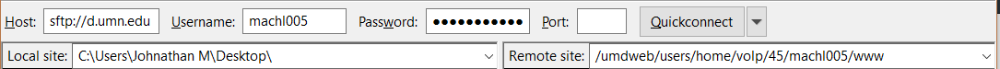

# Construction of a personal website.

[](https://www.w3schools.com/css/)
[](https://www.w3schools.com/html/default.asp)
[](https://www.w3schools.com/js/)

## How to 


### Dissect a URL address 
URL stands for universal resource indicator. Whenever someone types in an physical address which consists of a string of 
letters into their browser the DNS (domain name service) servers resolve this into an IP address which is used to route where to 
recieve the packets to assembly the content within the browser.


scheme://prefix.domain:port/path/filename

E.g. http://d.umn.edu/~machl005/

* Scheme : http is a portocol, which the packets are transmitted from in this case, port 80 is used.
* Domain :  d.umn.edu is the domain part of the address which hosts the webpage.
* Path:    /~machl005  is the directory path in this case its to a home indicated by the tilde ~ to a paricular user. 



Looking at the fields that need to be filled out in FileZilla you can see how the anatomy of a website, the login, and the directory 
are all interlinked.  When loggining in and uploading the folder consistenting of all the interlinked files for the website port 22 is used corresponding to the use of the SFTP protocol. 

### Construct the HTML page .html file 
Getting started 

The common main setup of tags you will need for any website is what is seen below. 

~~~~
<!DOCTYPE html>
<!-- saved from url=(0037)http://d.umn.edu/~machl005/index.html -->
<html>
<head>
	
  <title> Put your title here </title>
  <link rel="stylesheet" type="text/css" href="style.css">
  <meta name="description" content="">                              
  <meta name="keywords" content="">
  <meta name="author" ">
</head>
<body>
<h1> Title as seen on page </h1>
<h2>  Somewhat important stuff less slightly less important than the 'h1' tag </h2>
<div> 
<p> A full paragraph goes here.</p>
</div>
</body>
</html>
~~~~


### Construct the cascading style sheet .css file 
The antonomy of this code is that p is the selector 
containing the properties color and text-align. Precedence of each of these instances is from bottom up meaning that things at the bottom could overwrite styling done at the top hence the aspect of the name 'cascading'.Respectively, red and center correspond as values to these properties. In other languages, like Python, this construction would be called a dictionary which form of a data structure. 

~~~~
p {
  color: red;
  text-align: center;
}
~~~~


### Convert a .jpeg, .gif, png to a .ico for website icon 

### Arrange the file directory
    setup a file tree 
    
### Upload website through Filezilla 


### File permissions 
Every file and directory in your UNIX/Linux system has following 3 permissions defined for all the 3 owners discussed above.

* Read: This permission give you the authority to open and read a file. Read permission on a directory gives you the ability to lists its content.

* Write: The write permission gives you the authority to modify the contents of a file. The write permission on a directory gives you the authority to add, remove and rename files stored in the directory. Consider a scenario where you have to write permission on file but do not have write permission on the directory where the file is stored. You will be able to modify the file contents. But you will not be able to rename, move or remove the file from the directory.

* Execute: In Windows, an executable program usually has an extension ".exe" and which you can easily run. In Unix/Linux, you cannot run a program unless the execute permission is set. If the execute permission is not set, you might still be able to see/modify the program code(provided read & write permissions are set), but not run it.


In FileZilla, if you right click and select file permissions you can edit the file attributes assigning a specific numerical value  (in octal), which corresponds to the range of file permissions in binary. 

Commonly, these are the two most used defaults in a directory: 
* Folders – 755
* Files – 644

## Get ranked

### Setup meta tags 
The purpose of these tags in html is to contain and encapsulate data about the data within the rest of the file. This is not just a trivial thing for someone searching your website to see the header information ranked on google. It is also for webcrawlers like google to determine where your website belongs in a keyword space.  To take advantage of the search engine optimization algorithms google uses these Meta tags must be well thought out as to connect the source content with a target audience.

~~~~
<head><meta http-equiv="Content-Type" content="text/html; charset=UTF-8"><link rel="shortcut icon" type="image/x-icon" href="http://d.umn.edu/~machl005/BlueAbstract.ico">


	
<title> Johnathan Machlers Homepage</title>
<link rel="stylesheet" type="text/css" href="style.css">


  <meta name="description" content="This is a meta tag desciption of Johnathan Machlers Website. 
                                    If you are looking for content which is educational, that will occupy 
                                    your freetime. You've come to the right place!">
                                    
  <meta name="keywords" content="Electronics,EE,puzzles">
  <meta name="author" content="Johnathan Machler">
 </head>
 ~~~~
 
 
 ```
 With each of these tags you can see  the different attributes for with the values description, keywords, and author.
```

### Make the robots.txt file
When a robot looks for the "/robots.txt" file for URL, it strips the path component from the URL (everything from the first single slash), and puts "/robots.txt" in its place.

For example, for "http://www.example.com/shop/index.html, it will remove the "/shop/index.html", and replace it with "/robots.txt", and will end up with "http://www.example.com/robots.txt".

So, as a web site owner you need to put it in the right place on your web server for that resulting URL to work. Usually that is the same place where you put your web site's main "index.html" welcome page. Where exactly that is, and how to put the file there, depends on your web server software. 

~~~~
User-agent: *
Disallow:
Sitemap: http://d.umn.edu/~machl005/sitemap.xml
~~~~


### A sitemap.xml file 

Generating a sitemap of your website is simple and easy. 
if you go to this [xml-sitemps.com](https://www.xml-sitemaps.com "sitemap.xml creation page ").
~~~~
<?xml version="1.0" encoding="UTF-8"?>
<urlset
      xmlns="http://www.sitemaps.org/schemas/sitemap/0.9"
      xmlns:xsi="http://www.w3.org/2001/XMLSchema-instance"
      xsi:schemaLocation="http://www.sitemaps.org/schemas/sitemap/0.9
            http://www.sitemaps.org/schemas/sitemap/0.9/sitemap.xsd">
<!-- created with Free Online Sitemap Generator www.xml-sitemaps.com -->


<url>
  <loc>http://www.d.umn.edu/~machl005/</loc>
  <lastmod>2019-07-05T01:05:42+00:00</lastmod>
</url>


</urlset>
~~~~

> Thats all there is to it!


## Link content


### Exporting bookmarks into Bookmarks.html from your browser
* Go into settings 
* click bookmarks 
* export bookmarks


### Run scripting languages within the website 
Inside webpages its common to have scripts which coordinate various activities and logics. 
In this particular instance, these scripts have on the website is really minor most the time though languages like 
JavaScript and SQL coordinate backend activities to fetch data from databases and APIs to update the site in realtime. In 
this sense these scripting is important because it makes your site much more fluid. 

~~~~
<footer id="Main-footer">
          <h4>Date/Time: <span id="datetime"></span></h4> 
          <script src="DateTime.js"></script>
	  <script src="VistorCounter.js"></script>
</footer>   
~~~~

```
In the directory the scripts  DataTime.js  and VistorCounter.js need to be within scope, so that the html can run the scripts within the page.
```

### Embed social media posts and videos on a website
To get the embedded links hit share (which usually has a ... or an arrow icon) then embed should be one of the options in the pulldown.
~~~~
<iframe width="560" height="315" src="https://www.youtube.com/embed/qkXOxLpdMds" frameborder="0" allow="accelerometer; autoplay; encrypted-media; gyroscope; picture-in-picture" allowfullscreen></iframe>
~~~~
```
Youtube video embedding with an <iframe> tag.
```


## Setup a server
1. Go to www.apache.org and download the latest version of Apache's webserver.
2. Install Apache.
3.  In the installation process you will get a screen asking you for your domain name, network name, and e-mail address. You can add    anything in these fields. Add them in this format:
* Domain name: website.com
* Network name: www.website.com
* E-mail address: username@website.com

4. Once you click Next, you will see a screen asking you what webserver this is. You can choose Apache from the radio button list
5. You will get an error message after telling you "Apache could not be configured." "Edit you Apache.conf file"
6. Next go to Start-Programs-Apache HTTP server <version number>
7. Choose "Configure Apache Server".
8. Choose "Edit the apache.conf configuration file".
9. Go to Document Root "drive:/location"
10. Change the document root to point to the location of your website folder in the notion noted above using / instead of \.


